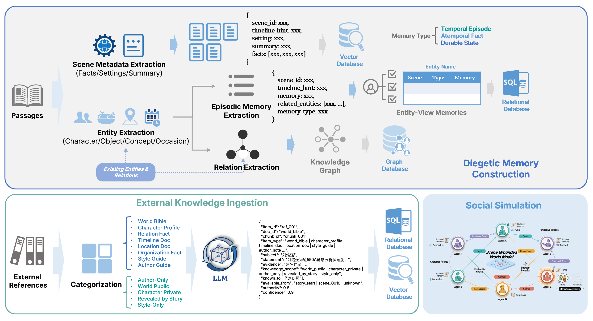

# Diegetic Memory Society

Diegetic Memory Society is a prototype memory system for long-form writing. It turns completed scenes into timeline-bounded assets: a small knowledge graph, evidence-grounded episodic memories, scene summaries, entity attribute cards, social simulation outputs, and writing/evaluation artifacts.



## Current Status

The repository now contains a working Python prototype rather than only the original concept note.

- Scene processing is ordered by story/script scene, while independent extraction tasks inside one scene can run concurrently.
- Long scenes are split with a configurable maximum chunk size, currently defaulting to `800` English words or Chinese characters.
- Extracted entity types are intentionally limited to seven graph-facing categories: `character`, `group`, `organization`, `location`, `object`, `concept`, and `occasion`.
- Episodic memories keep source evidence for traceability, and evidence is aligned back to the original scene text.
- Durable relations are reserved for longer-lived state-like relationships rather than momentary actions.
- SQLite stores entities, aliases, relations, memories, scene summaries, metadata, and retrieval documents.
- Chroma provides vector retrieval over memory and summary documents.
- The retrieval pipeline builds a prefix-only memory packet for a target scene, so generation cannot read target or future scene memories.
- Social-simulation intent extraction produces a low-information `social_simulation_intent` for exploratory character behavior.
- Writing-intent extraction produces a concise author-facing `writing_intent` for retrieval and generation.
- Writing-spec extraction produces `writing_spec` as evaluation ground truth only; it is not fed into writing prompts.
- Social simulation is positioned as a low-spec ideation layer: it uses the low-information social intent plus retrieved memory and character cards to suggest plausible character behavior.
- Writing generation uses a separate `writing_llm` config section, receives an explicit previous-scene continuity context by default in benchmark runs, and does not apply automatic post-generation repair.
- Evaluation is LLM-as-judge over three dimensions: writing intent consistency, writing quality, and memory faithfulness.
- A Gradio UI is available for inspecting benchmark runs, scene artifacts, memory packets, social simulation, drafts, and scores.

## Repository Layout

```text
src/dms/
  benchmark.py              # full writing benchmark orchestration
  cli.py                    # command line entry points
  config.py                 # local YAML model config loader
  evaluation/               # scene eligibility and writing evaluation
  llm/                      # fake and OpenAI-compatible model clients
  memory/                   # staged memory, KG, relations, world model
  parsing/                  # JSON extraction with json_repair fallback
  prompts/                  # YAML prompt loading
  retrieval/                # memory packet construction
  runners/                  # extraction runners and ordered pipeline
  scripts/                  # source script adapters
  simulation/               # attribute cards and social simulation
  storage/                  # SQLite import and Chroma indexing
  ui/                       # Gradio app
task_specs/
  prompts/dms/              # prompt-managed extraction, simulation, writing, eval tasks
  task_settings/            # task-level schemas and policies
data/evaluation_splits/     # committed deterministic eligibility splits
scripts/
  run_full_benchmark.sh     # long-running full-script tmux entry point
```

Local-only files are intentionally ignored by git:

- `configs/local_config.yaml`
- `configs/local_model_config.yaml`
- `data/raw/`
- `runs/`
- `outputs/`
- `logs/`

## Setup

The current development environment is the local conda environment named `screenplay`.

```bash
conda activate screenplay
cd DiegeticMemorySociety
export PYTHONPATH=src
```

Install editable package metadata if needed:

```bash
pip install -e .
```

For Chroma indexing and the UI, the environment also needs `chromadb` and `gradio`.

## Local Config

Use a local YAML config at `configs/local_config.yaml`. This file is ignored and should not be committed.

```yaml
llm:
  provider: openai
  model_name: Qwen3-235B-FP8
  api_key: <local-token>
  base_url: http://127.0.0.1:8002
  max_tokens: 4096
  timeout: 240
  temperature: 0

embedding:
  provider: openai
  model_name: bge-m3
  api_key: not-needed
  base_url: http://localhost:8080/v1
  max_tokens: 8192
  dimensions: 1024
  timeout: 60

writing_llm:
  provider: openai
  model_name: gpt-5.5
  api_key: <local-secret>
  base_url: <writing-llm-openai-compatible-base-url>
  max_tokens: 4096
  timeout: 240
  temperature: 0.7
  reasoning_effort: high
```

## Common Commands

Inspect the raw script:

```bash
python -m dms.cli inspect-script data/raw/流浪地球2剧本.json --limit 3
```

Build deterministic scene eligibility splits:

```bash
python -m dms.cli build-scene-eligibility \
  data/raw/流浪地球2剧本.json \
  --output-dir data/evaluation_splits/we2_scene_eligibility_20260530
```

Run ordered extraction for a small pilot batch:

```bash
python -m dms.cli run-scene-ordered-pipeline \
  data/raw/流浪地球2剧本.json \
  --output-root runs/scene_ordered/we2_scene12345_qwen235_8002_7types \
  --start 1 \
  --limit 5 \
  --model-config configs/local_config.yaml \
  --model-section llm \
  --scene-task-concurrency 3 \
  --max-chunk-units 800 \
  --overwrite
```

Import an ordered run into SQLite:

```bash
python -m dms.cli build-asset-store \
  --run-root runs/scene_ordered/we2_scene12345_qwen235_8002_7types \
  --output-db runs/assets/we2_scene12345_7types.sqlite \
  --overwrite
```

Build a Chroma index with the configured embedding service:

```bash
python -m dms.cli build-chroma-index \
  runs/assets/we2_scene12345_7types.sqlite \
  --persist-dir runs/assets/we2_scene12345_7types_chroma_bge_m3 \
  --collection-name dms_retrieval_documents_bge_m3 \
  --model-config configs/local_config.yaml \
  --embedding-section embedding \
  --overwrite
```

Run the current scene-6 smoke benchmark against scene-1-to-5 assets:

```bash
python -m dms.cli run-writing-benchmark \
  data/raw/流浪地球2剧本.json \
  --db-path runs/assets/we2_scene12345_7types.sqlite \
  --chroma-dir runs/assets/we2_scene12345_7types_chroma_bge_m3 \
  --collection-name dms_retrieval_documents_bge_m3 \
  --output-dir runs/benchmark/we2_scene6_new_pipeline \
  --target-scene-id scene_0006 \
  --limit 1 \
  --overwrite
```

Launch the UI:

```bash
python -m dms.cli launch-ui \
  --benchmark-dir runs/benchmark/we2_scene6_new_pipeline \
  --db-path runs/assets/we2_scene12345_7types.sqlite \
  --chroma-dir runs/assets/we2_scene12345_7types_chroma_bge_m3 \
  --collection-name dms_retrieval_documents_bge_m3 \
  --server-port 7860
```

## Full Script Run

The full-script workflow can take a long time. Use the provided script inside `tmux`:

```bash
tmux new-session -d -s dms_full \
  'cd /path/to/DiegeticMemorySociety && bash scripts/run_full_benchmark.sh'
```

The script performs:

1. full ordered extraction over all scenes;
2. SQLite asset-store import;
3. Chroma vector index build;
4. full writing benchmark over all eligible writing targets.

Outputs are written under `runs/`, and logs are written under `logs/`.

Useful overrides:

```bash
RUN_ID=we2_full_qwen235_8002_20260531 \
PYTHON_BIN=/path/to/conda/envs/screenplay/bin/python \
SCENE_TASK_CONCURRENCY=3 \
MAX_CHUNK_UNITS=800 \
bash scripts/run_full_benchmark.sh
```

For a bounded dry pilot, set `SCENE_LIMIT` and `BENCHMARK_LIMIT`.

## Evaluation

The writing benchmark compares generated text and the original reference scene under the same judge prompt. The reported metrics are:

- `writing_intent_consistency`
- `writing_quality`
- `memory_faithfulness`

Reference scores are used as calibration, not as a demand that generation copy the original scene.

## Verified Smoke Tests

The standardized scene-6 workflow has been run with scene-1-to-5 assets. The run completed one target scene with:

- 4 retrieved entities;
- 17 retrieved episodic memories;
- 1 durable relation;
- 5 related scene summaries;
- 2 attribute cards;
- 2 character simulations.

Recent targeted regression command:

```bash
PYTHONPATH=src python -m pytest \
  tests/test_writing_benchmark.py \
  tests/test_gradio_app.py \
  tests/test_writing_e2e_workflow.py \
  tests/test_writing_evaluation.py \
  tests/test_config.py \
  tests/test_prompt_loader.py \
  -q
```

Result: `22 passed`.
